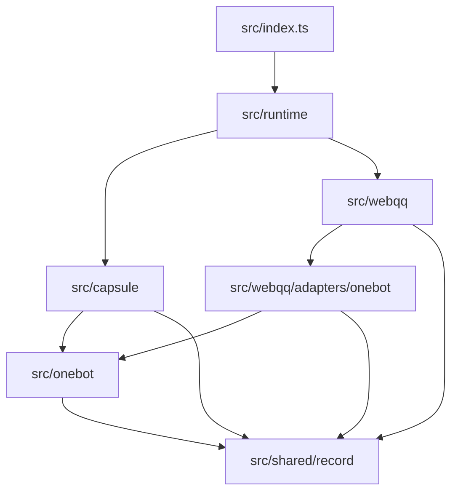
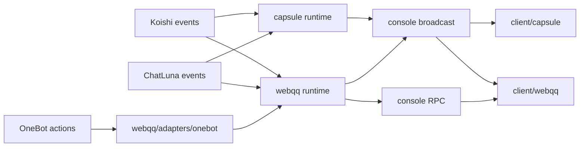

# ADR 0001：OneBot WebQQ 架构整理方案

## 状态

已接受。

## 背景

当前插件同时提供 Koishi Console 右下角小胶囊和 WebQQ 观察窗，并联动 OneBot、ChatLuna、ChatLuna Character、ChatLuna Affinity、ChatLuna Schedule 等能力。代码已经有 `src/onebot/`、`src/webqq/`、`src/chatluna/`、`src/state/`、`src/shared/` 的初步分层，但职责仍然混杂：

- `src/index.ts` 同时承担插件装配、胶囊状态、WebQQ runtime、ChatLuna 事件、Console RPC、存储表注册等职责。
- `src/onebot/` 既有 OneBot action 和协议适配，也直接导出 WebQQ 类型与 `createOneBotWebQQService()`。
- `src/state/` 实际是小胶囊状态，但名称过于泛化。
- `client/state.ts` 同时包含胶囊状态、OneBot bot 状态、WebQQ 数据模型、WebQQ UI 配置。
- `client/` 主要按 `components/`、`stores/`、`styles/`、`utils/` 技术类型平铺，改 WebQQ 或小胶囊时需要跨目录查找。

这次整理的目标不是重写功能，而是建立可持续的源码边界，让后续按小胶囊、WebQQ、OneBot 分别演进。ChatLuna 相关代码按真实消费方归属，不再作为顶层集成层。

## 决策

保留 `src/` 和 `client/` 两个构建根目录，在各自内部按领域镜像拆分：

- `capsule/`：小胶囊功能域，负责胶囊状态、胶囊 UI、bot 展示、打开 WebQQ 的入口。
- `webqq/`：WebQQ 观察窗功能域，负责联系人、消息流、通知、存储、媒体、消息展示。
- `onebot/`：OneBot 协议适配层，只负责 action 调用、bot 选择、协议差异、原始数据读取和媒体基础能力。
- `webqq/adapters/onebot/`：把 OneBot 数据转换成 WebQQ 模型的适配层。
- `webqq/types.ts`：WebQQ 观察窗的 view model 类型归属点；`onebot` 不再长期导出 `WebQQ*` 类型。
- ChatLuna 相关实现按消费方放置：胶囊活动、响应锁和消息输入归 `capsule/`；WebQQ 完整 thinking、affinity、relationship 展示归 `webqq/`。
- `shared/`：只保留真正跨领域、无业务语义的 record 读取工具。当前目标只需要 `record.ts`。
- `runtime/`：很薄的插件运行时装配层，只创建和传递共享依赖，不写业务流程。

`src/index.ts` 最终只保留插件元信息、公开导出和装配调用，不直接承载业务流程。

## 领域依赖图



## 运行时数据流图



## 目标后端文件树

```text
src/
  index.ts
  config.ts
  plugin-context.ts
  runtime/
    create-runtime.ts
    types.ts
  capsule/
    register.ts
    console-entry.ts
    chatluna-activity.ts
    character-lock.ts
    message-input.ts
    state/
      index.ts
      types.ts
  webqq/
    types.ts
    display.ts
    register.ts
    console-rpc.ts
    affinity.ts
    thinking.ts
    message-flow/
      session.ts
      live-runtime.ts
      live-message.ts
      live-elements.ts
      live-cache.ts
      live-reactions.ts
      live-notices.ts
    storage/
      schema.ts
      state.ts
      message-cache.ts
      recall-cache.ts
      scope.ts
    contacts/
    notices/
      event-notices.ts
    media/
      image-url-resolver.ts
      record.ts
    sender/
      sender-metadata.ts
    adapters/
      onebot/
        service.ts
        contacts.ts
        messages.ts
        message-elements.ts
        media.ts
        text.ts
        notices.ts
        group-info.ts
        group-sender-metadata.ts
        reactions.ts
  onebot/
    actions.ts
    bots.ts
    protocol.ts
    data.ts
    media/
      images.ts
      records.ts
  shared/
    record.ts
```

文件名可以在实际迁移中按现有代码微调，但领域归属和依赖方向不能反向。

## 目标前端文件树

```text
client/
  index.ts
  style.scss
  entry-state.ts
  capsule/
    Capsule.vue
    state.ts
    api.ts
    avatar-theme.ts
    bot-stack.ts
    styles.scss
  webqq/
    WebQQObserver.vue
    api/
      webqq.ts
    components/
      WebQQSidebar.vue
      WebQQNoticeMenu.vue
      WebQQMessageList.vue
      WebQQImagePreview.vue
      WebQQForwardModal.vue
      WebQQGroupInfoPanel.vue
      WebQQMessageReactions.vue
      WebQQContactList.vue
    stores/
    storage/
      browser-message-cache.ts
      webqq-storage.ts
    styles/
    utils/
    types.ts
    settings.ts
    sender-metadata.ts
    unread.ts
  onebot/
    bots.ts
```

`client/webqq/` 内部仍可按 `components/`、`stores/`、`styles/`、`utils/` 组织，但这些目录只服务 WebQQ，不再和胶囊混放。

## 模块边界

允许依赖：

- `runtime` 可以创建共享依赖，并把依赖传给 `capsule` 和 `webqq`。
- `webqq/adapters/onebot` 可以依赖 `onebot`，把 OneBot 数据转换成 WebQQ 模型。
- `capsule` 可以依赖 OneBot 的 bot profile 或只读 bot 状态。
- `capsule/message-input.ts` 自己负责 Koishi session 到 `CapsuleMessageInput` 的读取；可以保留少量本地 helper，不通过 `webqq/session.ts` 复用。
- `capsule` 可以在自己的 module 内消费 ChatLuna 事件，生成胶囊活动状态。
- `webqq` 可以在自己的 module 内消费 ChatLuna Character payload，生成 WebQQ thinking 展示。
- `webqq/message-flow/session.ts` 只负责 Koishi/OneBot session 到 WebQQ peer、direction、sender metadata 的转换。
- 业务域只能依赖 `shared/record.ts` 的 `isRecord`、`readRecordText` 这类无业务语义的 record reader。

禁止依赖：

- `onebot` 不得依赖 `webqq`。
- `onebot` 不得依赖 `capsule`。
- `onebot` 不得长期导出 `WebQQ*` view model 类型；这些类型归 `webqq/types.ts`。
- `onebot/data.ts` 不得长期收纳 QQ 头像 URL、群角色中文化、群副标题这类 WebQQ 展示 helper；这些归 `webqq/display.ts` 或 WebQQ 内部模块。
- `onebot/events` 不承载 WebQQ 专用 raw socket 拦截；贴表情 raw event 拦截归 `webqq/adapters/onebot/reactions.ts`。
- `webqq/sender/` 不直接读取 OneBot action；读取群成员信息这类 OneBot 调用归 `webqq/adapters/onebot/group-sender-metadata.ts`。
- `webqq/message-flow/` 不直接 import `onebot/*`；历史消息、CQ/XML 文本、segment 展示归一化由 `webqq/adapters/onebot/*` 提供。
- `shared` 不得依赖任意业务领域。
- `shared` 不得收纳 OneBot action result、OneBot id、timestamp、WebQQ storage codec、WebQQ thinking、affinity 或 Console event 名称。
- 不建立 `client/shared/`，除非前端真的出现两个以上领域共同依赖的深 module。（该例外已于 ADR 0008 被行使：跨模块实例共享状态的兜底被四个前端领域共同依赖，判据与准入门槛见 ADR 0008。本条决定本身不变。）
- 不建立顶层 `chatluna/` 或 `integrations/chatluna/`，除非未来出现真实复用的第二个 adapter seam。
- `webqq/affinity.ts` 不得迁到共享层；它只服务 WebQQ 消息展示。
- `webqq/thinking.ts` 不得被 `capsule` 依赖；胶囊只记录活动状态和 duration。
- `client/webqq` 不得直接依赖 `client/capsule`。
- `client/capsule` 不得直接依赖 `client/webqq`，打开 WebQQ 这类交互必须通过明确的共享状态或事件边界表达。

## 外部兼容边界

第一轮架构整理必须保持这些外部可见协议不变：

- Koishi Console 事件名不变，例如 `onebot-webqq/update`、`onebot-webqq/bots/update`、`onebot-webqq/webqq/message`、`onebot-webqq/webqq/storage/load`。
- 数据库表名不变，例如 `onebot_webqq_storage`。
- 浏览器本地存储 key 不变，例如 `onebot-webqq:webqq:v1`、`onebot-webqq:bot-profile:v1`、`onebot-webqq:webqq-avatar-guide:v1`。
- 配置项名称、默认值和语义不变。
- npm 包入口、Koishi 插件名和构建入口不变。

目录、内部函数、内部模块可以迁移；外部协议默认不改。

## 分批迁移计划

### 第 1 批：写入架构文档

新增本 ADR，确认目标边界、文件树、依赖规则、分批计划和验证标准。不改源码行为。

### 第 2 批：前端纯结构迁移

按领域移动 `client/` 文件，修正导入路径，保持行为不变：

- 把 `Capsule.vue`、胶囊样式、胶囊状态迁入 `client/capsule/`。
- 把 WebQQ 组件、store、style、utils、storage 迁入 `client/webqq/`。
- `client/webqq-message-cache.ts` 迁入 `client/webqq/storage/browser-message-cache.ts`。
- `client/webqq-sender-metadata.ts` 迁入 `client/webqq/sender-metadata.ts`。
- 拆分 `client/state.ts`，但不改字段名、ref 语义和数据结构。
- 保留 `client/index.ts` 作为前端入口装配。
- 保留 `client/style.scss` 作为样式入口聚合文件；具体样式按胶囊和 WebQQ 归入各自目录。

### 第 3 批：后端纯结构迁移

按领域移动 `src/` 文件，修正导入路径，保持行为不变：

- `src/state/*` 迁入 `src/capsule/state/*`。
- `src/console/entry.ts` 迁入 `src/capsule/console-entry.ts`。
- `src/chatluna/message-input.ts` 迁入 `src/capsule/message-input.ts`。
- `src/chatluna/character-lock.ts` 迁入 `src/capsule/character-lock.ts`。
- `src/chatluna/thinking.ts` 迁入 `src/webqq/thinking.ts`。
- `src/webqq/affinity.ts` 保持 WebQQ 归属。
- `src/onebot/types.ts` 拆分：`OneBotRobotProfile`、`OneBotRobotState` 和 OneBot 协议相关类型留在 OneBot；`WebQQ*` view model 类型迁入 `src/webqq/types.ts`。
- `src/webqq/session.ts` 拆分：胶囊消息输入需要的 bot/channel/user 读取逻辑内聚到 `src/capsule/message-input.ts`；WebQQ peer、direction、sender metadata 读取迁入 `src/webqq/message-flow/session.ts`。
- `src/shared/structured-text.ts` 拆分：`isRecord` 和 `readRecordText` 迁入 `src/shared/record.ts`；`getStringField`、`getNumberField`、`getBooleanField`、OneBot action/id/time/result helpers 迁入 `src/onebot/data.ts`；`readStructuredText` 迁入 `src/webqq/thinking.ts` 或 WebQQ 内部文本 module；`readRecordNumber` 内联到 `src/webqq/affinity.ts`。
- `src/onebot/data.ts` 拆分：OneBot action/id/time/result helpers 留在 `src/onebot/data.ts`；QQ 头像 URL、群角色中文化、群副标题迁入 `src/webqq/display.ts`。
- `src/webqq/group-sender-metadata.ts` 迁入 `src/webqq/adapters/onebot/group-sender-metadata.ts`；`src/webqq/sender/sender-metadata.ts` 只保留 metadata 读写/合并逻辑。
- `src/onebot/text.ts` 迁入 `src/webqq/adapters/onebot/text.ts`；当前文本 helper 服务的是 WebQQ 展示归一化，不是 OneBot action 层 interface。
- 暂时保留 `src/onebot/index.ts` 的兼容导出，避免一次性修改过多调用点。

### 第 4 批：拆薄 `src/index.ts`

把入口里的业务流程迁入领域 register：

- `src/capsule/register.ts` 负责胶囊状态、广播、bot 状态同步。
- `src/capsule/chatluna-activity.ts` 负责 ChatLuna before/after/model-usage/message_collect 到胶囊活动状态。
- `src/webqq/register.ts` 负责 WebQQ live runtime、通知、reaction、storage 表注册。
- `src/runtime/create-runtime.ts` 只创建共享依赖，不写业务流程。

### 第 5 批：拆分 OneBot 与 WebQQ 适配

把 `src/onebot/` 中 WebQQ 专用转换迁到 `src/webqq/adapters/onebot/`：

- WebQQ 联系人、群信息、消息、通知、最近会话、reaction 用户转换归 WebQQ 适配层。
- `src/onebot/card.ts`、历史消息 segment 归一化、image/record element 归一化迁入 `src/webqq/adapters/onebot/message-elements.ts` 或 `media.ts`；OneBot 层只留下 action resolver。
- `src/onebot/raw-event.ts` 的贴表情 socket 拦截迁入 `src/webqq/adapters/onebot/reactions.ts`。
- OneBot 层只保留 action、bot、协议、原始数据读取、基础媒体能力。
- 清理 `onebot -> webqq` 的反向依赖。

### 第 6 批：细分 WebQQ 内部模块

在 `src/webqq/` 内按真实职责拆分：

- `message-flow/`：live message、cache merge、reaction、recall、notice event。
- `storage/`：表结构、WebQQ 状态、消息缓存、撤回缓存、scope。
- `media/`：图片代理、语音解析和转写入口。
- `sender/`：发送者元数据和群成员元数据。

### 第 7 批：收敛 ChatLuna 消费点

按消费方收敛 ChatLuna 相关代码，不建立顶层共享集成层：

- 小胶囊在 `capsule/chatluna-activity.ts` 消费活动状态和 token 用量。
- `capsule/character-lock.ts` 只处理 ChatLuna Character 响应锁到胶囊状态的同步。
- WebQQ 在 `webqq/thinking.ts` 消费完整 `<think>` 内容。
- WebQQ 在 `webqq/affinity.ts` 消费 affinity 和 relationship。

## 每批验证

每批代码改动结束前必须运行：

```text
yarn typecheck
yarn test
yarn build
```

如果某批只改后端，也仍然运行 `yarn build`，因为项目同时有 tsup 和 Vite 两条构建链。不能采用“先大规模移动，最后再统一修”的方式；每批必须能构建、能测试、能解释 diff。

## 不建议做的事情

- 不建议把前后端混进同一个 `modules/` 目录。
- 不建议第一批代码改动就同时改目录、事件流、状态模型和 RPC 协议。
- 不建议让 `onebot/` 继续直接导出 WebQQ 类型作为长期结构。
- 不建议新建全局万能 `storage/` 层。
- 不建议把 `shared/` 做成工具垃圾桶；只有删除后会让复杂度重新散落到多个领域的 record reader 才能留在 shared。
- 不建议建立顶层 `chatluna/` 或 `integrations/chatluna/`；当前 ChatLuna 相关能力的消费方差异大，顶层集成层会变成 hypothetical seam。
- 不建议顺手改 Console 事件名、配置项、本地存储 key、数据库表名。
- 不建议在第一阶段引入复杂 service 容器或插件级框架化抽象。

## 后续执行原则

- 小功能小实现，每批只做当前批次需要的迁移。
- 先结构迁移，后行为解耦。
- 每一处代码移动都必须能对应本 ADR 的领域边界。
- 如果迁移中发现无关死代码，只记录问题，不在当前批次擅自删除。
- 如果需要更改外部协议，必须另起 ADR 或明确变更计划。
